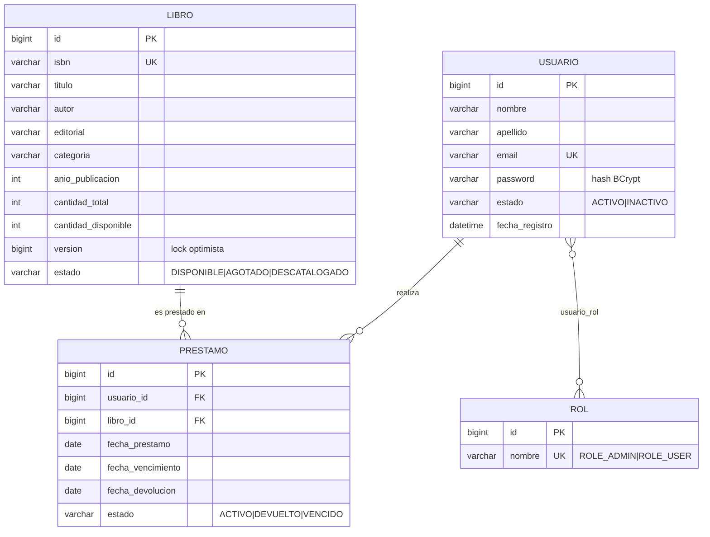

# 📚 API Biblioteca Universitaria

API RESTful profesional para la gestión de una biblioteca universitaria: catálogo de libros, usuarios con roles, préstamos y devoluciones, con **autenticación JWT stateless**, autorización granular por rol y por propietario, validaciones, manejo centralizado de errores, documentación OpenAPI y pruebas automatizadas.

---

## 1. Descripción y problema que resuelve

Las bibliotecas universitarias necesitan controlar su inventario de libros, quién los tiene prestados y cuándo deben devolverse, garantizando que solo el personal autorizado (ADMIN) administre el catálogo y que cada estudiante (USER) acceda únicamente a su propia información. Esta API centraliza esa gestión en un backend seguro, consistente y auditable.

## 2. Objetivos

- Administrar el catálogo de libros con control de inventario (total / disponible).
- Registrar y autenticar usuarios con roles (ADMIN / USER).
- Gestionar préstamos y devoluciones con reglas de negocio estrictas.
- Consultar disponibilidad, historial, préstamos activos/vencidos y estadísticas.
- Proteger cada operación con seguridad JWT y autorización granular.

## 3. Tecnologías

| Categoría | Tecnología |
|---|---|
| Lenguaje | Java 17 (LTS) |
| Framework | Spring Boot 3.3.5 |
| Seguridad | Spring Security 6 + JWT (jjwt 0.12.6) |
| Persistencia | Spring Data JPA + Hibernate |
| Base de datos | MySQL 8 (producción) · H2 (pruebas) |
| Validación | Jakarta Bean Validation |
| Documentación | springdoc-openapi (Swagger UI) |
| Pruebas | JUnit 5, Mockito, MockMvc, Spring Security Test |
| Build | Maven |

> **Nota sobre Java:** la rúbrica sugiere Java 21; el entorno de desarrollo usa **JDK 17 (LTS)**. Spring Boot 3.x es totalmente compatible con Java 17 y el proyecto no depende de características exclusivas de 21, por lo que se fija 17 en `pom.xml`. Migrar a 21 solo requiere cambiar `<java.version>`.

## 4. Arquitectura

Arquitectura **por capas** con responsabilidades únicas:

```
┌─────────────┐   HTTP/JSON
│  Controller │  ← validación de entrada, códigos HTTP, Swagger. Sin lógica de negocio.
└──────┬──────┘
       │ DTO
┌──────▼──────┐
│   Service   │  ← lógica de negocio, transacciones (@Transactional), reglas.
└──────┬──────┘
       │ Entity
┌──────▼──────┐
│ Repository  │  ← acceso a datos (Spring Data JPA). Sin lógica de negocio.
└──────┬──────┘
       │ JPA/Hibernate
┌──────▼──────┐
│   MySQL     │
└─────────────┘

Transversal: security (JWT) · exception (manejo centralizado) · mapper (Entity↔DTO) · config · validation
```

**Flujo de datos:** `API → DTO → Service → Entity → Repository`. Las entidades JPA **nunca** se exponen en las respuestas; los `mapper` convierten Entity ↔ DTO.

### Estructura del proyecto

```
src/main/java/com/universidad/biblioteca/
├── BibliotecaApplication.java
├── config/          # OpenApiConfig, DataInitializer (seed), JwtProperties, AppProperties
├── controller/      # AuthController, LibroController, UsuarioController, PrestamoController
├── dto/
│   ├── request/     # RegisterRequest, LoginRequest, RefreshTokenRequest, LibroRequest, PrestamoRequest
│   └── response/    # AuthResponse, UsuarioResponse, LibroResponse, PrestamoResponse, PageResponse, ApiError, EstadisticasResponse
├── entity/          # Usuario, Rol, Libro, Prestamo (+ enums)
├── exception/       # GlobalExceptionHandler + excepciones personalizadas
├── mapper/          # UsuarioMapper, LibroMapper, PrestamoMapper
├── repository/      # UsuarioRepository, RolRepository, LibroRepository, PrestamoRepository
├── security/        # SecurityConfig, JwtService, JwtAuthenticationFilter, EntryPoint, AccessDeniedHandler, UserPrincipal, AuthenticatedUser, SecurityUtils
├── service/         # Interfaces + impl/ (AuthService, LibroService, UsuarioService, PrestamoService)
└── validation/      # @ValidIsbn + IsbnValidator (checksum ISBN-10/13)
```

## 5. Modelo de datos (Diagrama ER)



Diseño **normalizado (3FN)**, con `UNIQUE` en `email` e `isbn`, claves foráneas explícitas, e **índices** en columnas de búsqueda y filtrado (título, autor, categoría, estado, vencimiento).

## 6. Requisitos

- **JDK 17+**
- **Maven 3.9+** (o usar el wrapper `mvnw`)
- **MySQL 8** en ejecución (solo para el perfil de producción; las pruebas usan H2)

## 7. Instalación

```bash
git clone <URL-del-repo>
cd gestion-libros
```

## 8. Configuración y variables de entorno

La configuración sensible se lee de **variables de entorno** (nunca hardcodeada). Copia el ejemplo y ajústalo:

```bash
cp .env.example .env   # y edita los valores
```

| Variable | Descripción | Ejemplo |
|---|---|---|
| `DB_URL` | URL JDBC de MySQL | `jdbc:mysql://localhost:3306/biblioteca_db?...` |
| `DB_USERNAME` | Usuario de BD | `root` |
| `DB_PASSWORD` | Contraseña de BD | `secreta` |
| `JWT_SECRET` | Secreto Base64 (≥32 bytes) para access token | `openssl rand -base64 48` |
| `JWT_REFRESH_SECRET` | Secreto Base64 distinto para refresh token | `openssl rand -base64 48` |
| `JWT_EXPIRATION` | Expiración access token (ms) | `900000` (15 min) |
| `JWT_REFRESH_EXPIRATION` | Expiración refresh token (ms) | `604800000` (7 días) |
| `ADMIN_EMAIL` | Email del admin inicial (seed) | `admin@biblioteca.edu` |
| `ADMIN_PASSWORD` | Contraseña del admin inicial (seed) | `Admin123!` |

> `.gitignore` excluye `.env`. Solo se versiona `.env.example`.

### Crear la base de datos

Opción A — Hibernate crea el esquema automáticamente (`ddl-auto=update`, por defecto).
Opción B — Ejecutar el script de referencia:

```bash
mysql -u root -p < src/main/resources/db/schema.sql
mysql -u root -p < src/main/resources/db/data.sql   # catálogo de ejemplo (opcional)
```

Al arrancar, `DataInitializer` crea de forma **idempotente** los roles y un usuario **ADMIN** inicial (con las credenciales de `ADMIN_EMAIL`/`ADMIN_PASSWORD`) solo si aún no existe ningún admin.

## 9. Ejecución

Con las variables de entorno cargadas (por ejemplo con `dotenv`, o exportándolas en la shell):

```bash
# Desarrollo
mvn spring-boot:run

# O empaquetar y ejecutar el jar
mvn clean package
java -jar target/biblioteca.jar
```

La API queda disponible en `http://localhost:8080`.

## 10. Documentación (Swagger / OpenAPI)

- **Swagger UI:** http://localhost:8080/swagger-ui.html
- **OpenAPI JSON:** http://localhost:8080/v3/api-docs

Pulsa **Authorize** en Swagger e introduce el `accessToken` (Bearer JWT) para probar los endpoints protegidos.

## 11. Autenticación y roles

Autenticación **JWT stateless** (sin sesiones HTTP):

1. `POST /api/auth/register` o `POST /api/auth/login` → devuelven `accessToken` (15 min) y `refreshToken` (7 días).
2. Enviar el access token en cada petición: `Authorization: Bearer <token>`.
3. Al expirar el access token: `POST /api/auth/refresh` con el refresh token.

| Rol | Puede |
|---|---|
| **ROLE_ADMIN** | CRUD de libros, préstamos a cualquier usuario, devoluciones, listados administrativos, vencidos, estadísticas, gestión de usuarios |
| **ROLE_USER** | Consultar catálogo y disponibilidad, ver su perfil e historial, solicitar y devolver **sus propios** préstamos |

> Un USER **no puede** acceder a información de otro usuario cambiando el ID en la URL: se aplica autorización por propietario en el servicio (403).

## 12. Endpoints

### Auth
| Método | Ruta | Acceso | Descripción |
|---|---|---|---|
| POST | `/api/auth/register` | Público | Registrar usuario (rol USER) |
| POST | `/api/auth/login` | Público | Login → tokens |
| POST | `/api/auth/refresh` | Público | Renovar access token |

### Libros
| Método | Ruta | Acceso | Descripción |
|---|---|---|---|
| GET | `/api/books` | Autenticado | Catálogo con filtros + paginación + orden |
| GET | `/api/books/{id}` | Autenticado | Libro por id |
| GET | `/api/books/isbn/{isbn}` | Autenticado | Libro por ISBN |
| POST | `/api/books` | ADMIN | Crear libro |
| PUT | `/api/books/{id}` | ADMIN | Actualizar libro |
| DELETE | `/api/books/{id}` | ADMIN | Eliminar libro |

### Usuarios
| Método | Ruta | Acceso | Descripción |
|---|---|---|---|
| GET | `/api/users/me` | Autenticado | Perfil propio |
| GET | `/api/users/me/historial` | Autenticado | Historial de préstamos propio |
| GET | `/api/users/admin` | ADMIN | Listar usuarios |
| GET | `/api/users/admin/{id}` | ADMIN | Usuario por id |
| GET | `/api/users/admin/{id}/historial` | ADMIN | Historial de cualquier usuario |
| PATCH | `/api/users/admin/{id}/estado?activo=` | ADMIN | Activar/desactivar usuario |

### Préstamos
| Método | Ruta | Acceso | Descripción |
|---|---|---|---|
| POST | `/api/loans` | Autenticado | Crear préstamo (USER: propio; ADMIN: `usuarioId`) |
| POST | `/api/loans/{id}/devolucion` | Propietario o ADMIN | Registrar devolución |
| GET | `/api/loans/{id}` | Propietario o ADMIN | Obtener préstamo |
| GET | `/api/loans?estado=` | ADMIN | Listar por estado (paginado) |
| GET | `/api/loans/vencidos` | ADMIN | Préstamos vencidos |
| GET | `/api/loans/estadisticas` | ADMIN | Estadísticas de préstamos |

## 13. Paginación y filtros

```
GET /api/books?page=0&size=10&sort=titulo,asc&titulo=clean&autor=martin&categoria=java&disponibles=true
```

Respuesta paginada (`PageResponse`):

```json
{
  "content": [ /* ... */ ],
  "page": 0, "size": 10, "totalElements": 42, "totalPages": 5,
  "first": true, "last": false
}
```

## 14. Ejemplos de request / response

**Login**

```bash
curl -X POST http://localhost:8080/api/auth/login \
  -H "Content-Type: application/json" \
  -d '{"email":"admin@biblioteca.edu","password":"Admin123!"}'
```
```json
{
  "accessToken": "eyJhbGciOiJIUzI1NiJ9...",
  "refreshToken": "eyJhbGciOiJIUzI1NiJ9...",
  "tokenType": "Bearer",
  "expiresIn": 900,
  "email": "admin@biblioteca.edu",
  "roles": ["ROLE_ADMIN"]
}
```

**Crear libro (ADMIN)**

```bash
curl -X POST http://localhost:8080/api/books \
  -H "Authorization: Bearer <accessToken>" \
  -H "Content-Type: application/json" \
  -d '{"isbn":"9780134494166","titulo":"Clean Architecture","autor":"Robert C. Martin","editorial":"Prentice Hall","categoria":"Ingenieria de Software","anioPublicacion":2017,"cantidadTotal":5}'
```

## 15. Manejo de errores

Todas las respuestas de error tienen el mismo formato (`ApiError`) y no exponen stack traces:

```json
{
  "timestamp": "2026-08-10T22:30:00",
  "status": 404,
  "error": "NOT_FOUND",
  "message": "Libro no encontrado con id: 999",
  "path": "/api/books/999",
  "details": null
}
```

| Código | Cuándo |
|---|---|
| 400 | Validación fallida (incluye `details` por campo) o cuerpo mal formado |
| 401 | Sin token / token inválido / credenciales inválidas |
| 403 | Rol insuficiente o acceso a recurso ajeno |
| 404 | Recurso no encontrado |
| 409 | Regla de negocio o duplicado (email/ISBN, doble devolución, sin disponibilidad) |
| 500 | Error interno (registrado en el servidor, no expuesto) |

## 16. Pruebas

```bash
mvn test
```

**31 pruebas** (unitarias + integración):

- **Unitarias:** reglas de negocio de préstamos (Mockito), emisión/validación JWT, validador de ISBN.
- **Integración (MockMvc + H2):** login, 401 sin token, 403 de USER, CRUD de libros por ADMIN, 404, 400 de validación, flujo completo préstamo→devolución→doble devolución (409), acceso a préstamo ajeno (403).
- **Smoke (Tomcat real + RANDOM_PORT):** arranque de la app y generación de OpenAPI.

## 17. Postman

Importar desde `postman/`:

- `Biblioteca.postman_collection.json` — colección completa (AUTH, BOOKS, USERS, LOANS) con tests de 200/201/400/401/403/404/409.
- `Biblioteca.postman_environment.json` — variables `baseUrl`, `accessToken`, `refreshToken`.

El request **Login** guarda automáticamente los tokens en el entorno.

## 18. Guion de demostración

1. `register` / `login` → obtener JWT.  2. Acceso ADMIN vs restricción USER (403).  3. Consultar/crear libro.  4. Préstamo y devolución.  5. Historial.  6. Errores 401/403/404/400/409.  7. Swagger.  8. Postman.  9. Persistencia en MySQL.

## 19. Auditoría de rúbrica

Ver [`AUDITORIA_RUBRICA.md`](AUDITORIA_RUBRICA.md): mapa criterio → implementación → archivo → endpoint → prueba.

## 20. Integrantes

- _Completar con los nombres del equipo._

## 21. Información para evaluación académica

- Build reproducible: `mvn clean verify`.
- Pruebas: `mvn test` (31 verdes, sin necesidad de MySQL — usan H2).
- Credenciales de demo (seed): `admin@biblioteca.edu` / `Admin123!` (configurable por entorno).
